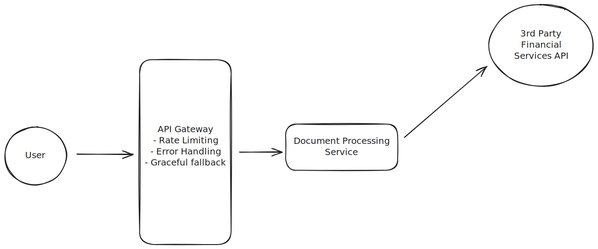

#  Look up and Fill

A prototype web application that parses portfolio files and fills in missing ticker symbols and company names through third party services __(Finnhub API)__.


## Design


- **Frontend**: Next.js 15.5.4 with TypeScript and Material-UI components
- **Backend**: FastAPI with Python 3.12+ and `pandas` for data processing

## Prerequisites

- **Node.js**: 18.18+ (required for Next.js 15)
- **Python**: 3.12+
- **npm**: Latest version
- **Redis**: 5.0+ (for caching)

## Backend Setup

1. **Redis Server (local)** (Caching Layer):
   For this project, I have utilized `redis-server` to minimize calls to the financial service API. You can follow the steps for installation from [here](https://redis.io/docs/latest/operate/oss_and_stack/install/archive/install-redis/) 
   
   ```bash
   # Verify redis-server is running
   redis-cli ping  # Should return "PONG"
   ```

2. Open a new terminal and navigate to the backend directory:
   ```bash
   cd backend
   ```

3. Create and activate a virtual environment _(assuming Unix)_:
   ```bash
   python3 -m venv .venv
   source .venv/bin/activate 
   ```

4. Install dependencies:
   ```bash
   pip install -r requirements.txt
   ```

5. Rename `.env.local` as `.env` and store your secrets. Visit [Finnhub](https://finnhub.io/) to create your API key

6. Start the FastAPI server:
   ```bash
   uvicorn app.main:app --reload --port 8000
   ```
The backend API will be available at `http://localhost:8000`

NOTE: For the sake of this demo, the default `BACKEND_PORT` is assumed to be `8000`. To change the port, use `--port <CUSTOM_PORT>`. 


## Frontend Setup

1. Navigate to the frontend directory:
   ```bash
   cd frontend
   ```

2. Install dependencies:
   ```bash
   npm install
   ```

3. Create environment file:
   ```bash
   cp .env.local.example .env.local
   ```

4. Update `.env.local` with backend URL:
   ```
   NEXT_PUBLIC_BACKEND_URL=http://localhost:<CUSTOM_PORT>
   ```

5. Start the development server:
   ```bash
   npm run dev
   ```

   The frontend will be available at `http://localhost:3000`

## API Endpoints

#### POST /api/v1/documents/upload
Upload and process CSV files with portfolio data.

#### POST /api/v1/documents/lookup/full
Perform _batched_ lookup for all missing portfolio data.

#### POST /api/v1/documents/lookup/single
Perform lookup for a single portfolio row.

## Testing (Optional)

To run the pytest suite including performance metrics (P50, P99 latency, throughput) and stress testing, 
- Install [ngrok](https://ngrok.com/download/linux), start your backend server, then run `ngrok http <BACKEND_PORT>` in a new terminal. 
- Set the NGROK URL as `export NGROK_TUNNEL_URL="<YOUR_NGROK_URL.app>"` and execute `pytest -s` from the backend directory to run tests. 


